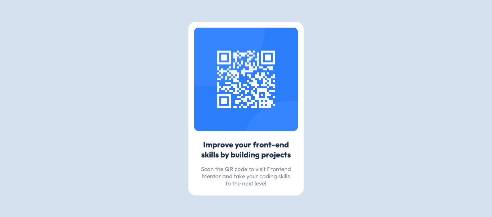

# QR code component Project

> This is the first challenge proposed by the Frontend Mentor platform to test (and improve) HTML and CSS knowledge

[🔗 Click here to access the website](https://github.com/matheusvaz-dev/qr-code-component)

## 🛠️ Technologies

- HTML;
- CSS.

## 📧 Contact

matheusvaz.ux@gmail.com
